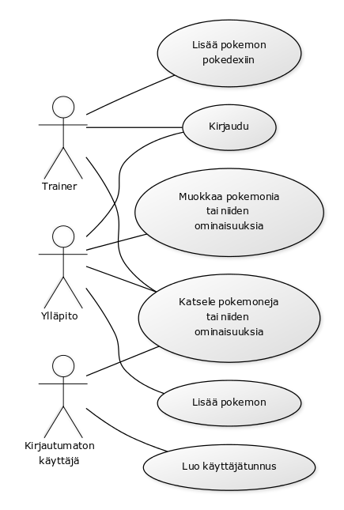
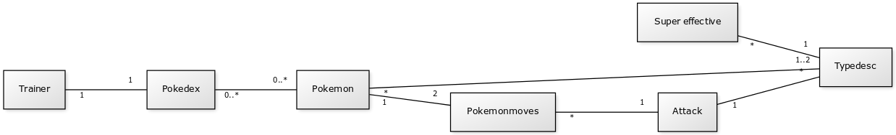
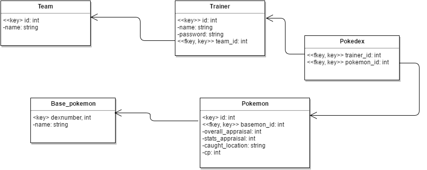

## Johdanto

Työn aihe on tietokanta Pokemon GO pelille.

Tarkoituksena on luoda tietokanta pelin eri pokemoneille, näiden attribuuteille ja niiden mahdollisille liikesarjoille, 
mahdollisesti myös evoluutioille sekä eri pokemonien evoluution vaatimalle jauhelihamäärälle.
Loppuvaiheessa toivottavaa olisi, että tietokannassa olisi kirjautumismahdollisuus jotta käyttäjät voisivat tietokantaa käyttäen
tallentaa sekä muokata omia pokemonkokoelmiaan.

Työ toteutetaan laitoksen users-palvelimella. Web-sovelluksen alustajärjestelmässä käytetään joko Javaa tai PHP:ta.

## Käyttötapaukset

### Pokemonin lisääminen
  Ylläpitäjä voi lisätä pokemoneja tietokantaan

### Pokemonin tietojen muuttaminen
  Ylläpitäjä voi tarvittaessa muuttaa pokemoniin liittyviä tietoja tai attribuutteja

### Pokemonien selaaminen
  Kaikki käyttäjät voivat selata tietokannan pokemoneja

### Pokemonien etsiminen tiettyjen hakukriteerien perusteella
  Käyttäjälle näytetään, esimerkiksi mitkä kaikki pokemonit tarvitsevat x jauhelihaa seuraavaan evoluutioonsa tai mitkä
  kaikki pokemonit ovat vesi-tyyppisiä, tai millä kaikilla pokemoneilla voi olla tietty perusliike

### Muita käyttötapauksia
  Rekisteröityminen, kirjautuminen

### Käyttötapauskaavio:

## Tietokannan tietosisältö

### Tietokannan käsitekaavio:

### Tietokohde: Trainer
Attribuutti | Arvojoukko | Kuvaus
-------- | ------ | ------
Nimi | Merkkijono, max 50 merkkiä | Trainerin käyttäjätunnus
Password | Merkkijono, max 50 merkkiä | Trainerin salasana

### Tietokohde: Type description
Attribuutti | Arvojoukko | Kuvaus
------ | ------- | -------
Nimi | Merkkijono, max 50 merkkiä | Pokémonin tai liikkeen tyyppi

### Tietokohde: Attack
Attribuutti | Arvojoukko | Kuvaus
------ | ------ | ------
Nimi | Merkkijono, max 50 merkkiä | Liikkeen nimi
Damage | Desimaali | Liikkeen tekemän vahingon määrä
Dps | Desimaali | Liikkeen tekemä vahinko per sekunti
Typedesc | Kokonaisluku, viite | Liikkeen tyyppi

### Tietokohde: Pokemon
Attribuutti | Arvojoukko | Kuvaus
------| ---------| -------
Dexnumber | Kokonaisluku | Pokémonin pokedexnumero
Nimi | Merkkijono, max 50 merkkiä | Pokémonin nimi
Typedesc A | Kokonaisluku, viite | Pokémonin primäärityyppi
Typedesc B | Kokonaisluku, viite | Pokémonin sekundäärityyppi
Attack | Kokonaisluku | Pokémonin hyökkäysvoima
Defense | Kokonaisluku | Pokémonin puolustusvoima
Stamina | Kokonaisluku | Pokémonin kestävyysvoima
Evolution | Kokonaisluku, viite | Pokémonin seuraava kehitysaskel
Jauheliha | Kokonaisluku | Seuraavan kehitysaskeleen vaatima jauhelihamäärä

### Tietokohde: Pokemonmoves
Attribuutti | Arvojoukko | Kuvaus
--------- | -------- | ---------
Pokemon | Kokonaisluku, viite | Kyseinen Pokémon
Attack | Kokonaisluku, viite | Kyseiselle Pokémonille mahdollinen liike

### Tietokohde: Pokedex
Attribuutti | Arvojoukko | Kuvaus
------ | ------ | ------
Trainer | Kokonaisluku, viite | Kyseinen trainer
Pokemon | Kokonaisluku, viite | Kyseisen trainerin keräämä Pokémon

###Tietokohde: Super effective
Attribuutti | Arvojoukko | Kuvaus
-------- | --------- | --------
Strong type | Kokonaisluku, viite | Vahva tyyppi
Weak type | Kokonaisluku, viite | Heikko tyyppi

### Tietokannan relaatiotietokantakaavio:

