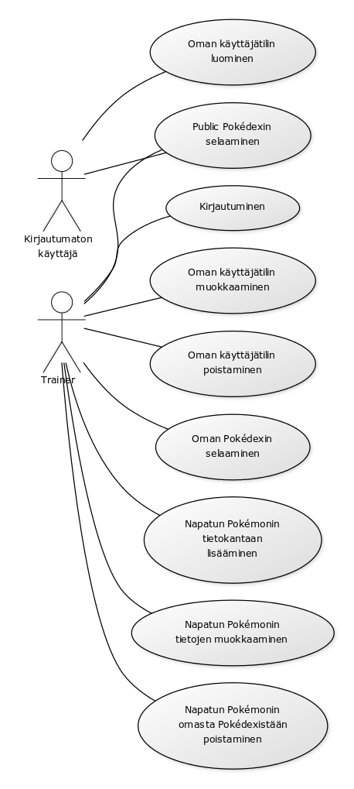

## Johdanto

Työn aihe on tietokanta Pokemon GO pelille.

Tarkoituksena on luoda tietokanta pelin eri pokemoneille, näiden attribuuteille ja niiden mahdollisille liikesarjoille, 
mahdollisesti myös evoluutioille sekä eri pokemonien evoluution vaatimalle jauhelihamäärälle.
Loppuvaiheessa toivottavaa olisi, että tietokannassa olisi kirjautumismahdollisuus jotta käyttäjät voisivat tietokantaa käyttäen
tallentaa sekä muokata omia pokemonkokoelmiaan.

Työ toteutetaan laitoksen users-palvelimella. Web-sovelluksen alustajärjestelmässä käytetään joko Javaa tai PHP:ta.

## Käyttötapaukset

### Pokemonin lisääminen
  Ylläpitäjä voi lisätä pokemoneja tietokantaan

### Pokemonin tietojen muuttaminen
  Ylläpitäjä voi tarvittaessa muuttaa pokemoniin liittyviä tietoja tai attribuutteja

### Pokemonien selaaminen
  Kaikki käyttäjät voivat selata tietokannan pokemoneja

### Pokemonien etsiminen tiettyjen hakukriteerien perusteella
  Käyttäjälle näytetään, esimerkiksi mitkä kaikki pokemonit tarvitsevat x jauhelihaa seuraavaan evoluutioonsa tai mitkä
  kaikki pokemonit ovat vesi-tyyppisiä, tai millä kaikilla pokemoneilla voi olla tietty perusliike

### Muita käyttötapauksia
  Rekisteröityminen, kirjautuminen

### Käyttötapauskaavio:

## Tietokannan tietosisältö

### Tietokannan käsitekaavio:

### Tietokohde: Trainer
Attribuutti | Arvojoukko | Kuvaus
-------- | ------ | ------
Nimi | Merkkijono, max 50 merkkiä | Trainerin käyttäjätunnus
Password | Merkkijono, max 50 merkkiä | Trainerin salasana

### Tietokohde: Pokemon
Attribuutti | Arvojoukko | Kuvaus
------| ---------| -------
Dexnumber | Kokonaisluku | Pokémonin pokedexnumero
Nimi | Merkkijono, max 50 merkkiä | Pokémonin nimi
Overall appraisal | Kokonaisluku | Pokémonin täydellisyysprosentin arvoluvun arviointi
Stats appraisal | Kokonaisluku | Pokémonin bonus Individual Value (IV) arvoluvun arviointi
Caught location | Merkkijono, max 400 merkkiä | Paikka josta Pokémon pyydystettiin
CP | Kokonaisluku | Pokémonin Combat Power 

### Tietokohde: Pokedex
Attribuutti | Arvojoukko | Kuvaus
------ | ------ | ------
Trainer | Kokonaisluku, viite | Kyseinen trainer
Pokemon | Kokonaisluku, viite | Kyseisen trainerin keräämä Pokémon

### Tietokannan relaatiotietokantakaavio:

## Tietokannan (alustava) käyttöohje

Kirjautumaton käyttäjä voi sivun yläreunasta valitsemalla linkin Pokédex selata tietokantaan lisättyjä Pokémoneja ja niiden tietoja.

Kirjautunut käyttäjä eli trainer voi tämän lisäksi lisätä pyydystämiensä Pokémonien tietoja sekä muokata tai poistaa omia Pokémonejaan.

Lisätessään Pokémonin, trainerin on lisättävä joitakin perustietoja Pokémonistaan kuten nimi ja pokedexnumero.

Appraisal-tietueisiin tietoa lisätessään on trainerin konsultoitava Pokémon GO applikaatiostaan joukkueensa johtajaa saadakseen overall sekä stats appraisal arvot.

Koska kullakin appraisal-arvolla on neljä eri jakaumaa, on tietokantaan lisättävä tieto mukautettu lisättäväksi asteikolla 1-4.

Appraisal | 1 | 2 | 3 | 4 
------|-----|-----|-----|-----
Overall | 0%-50% | 51%-66% | 67%-79% | 80%-100%
Stats | max 0-7 bonus IV | max 8-12 bonus IV | max 13-14 bonus IV | max 15 bonus IV.

Tarkemmat ohjeet joukkuekohtaisten johtajien antamien arvioiden tulkitsemiseksi ovat tulossa piakkoin.

Trainerien toivotaan lisäävän mahdollisimman tarkka Pokémonin pyydyspaikka tietokantaan, jotta samankaltaisia Pokémoneja metsästävät trainerit voisivat käyttää tietokannan antamia tietoja metsästysapajista hyväkseen.

